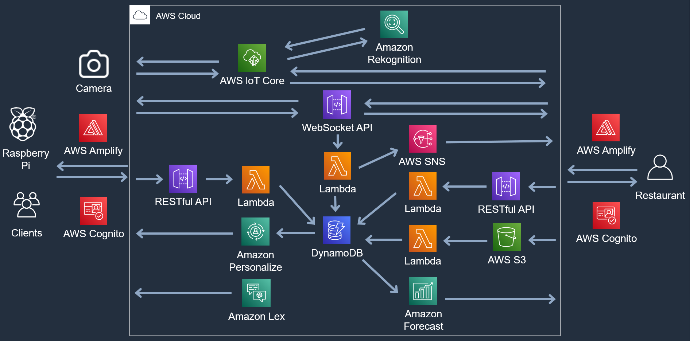
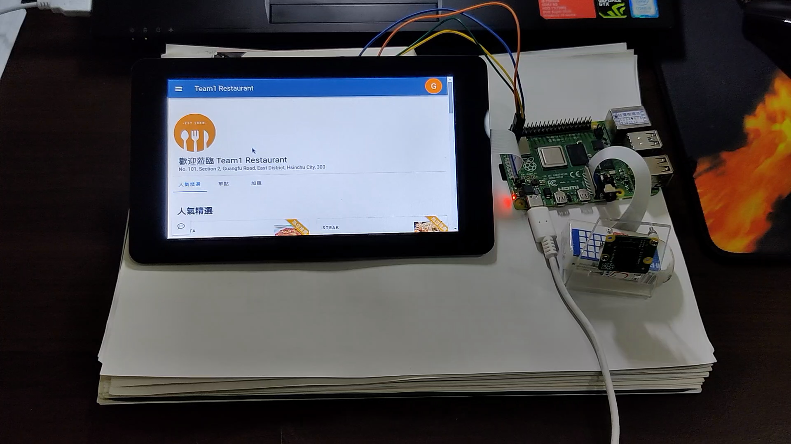
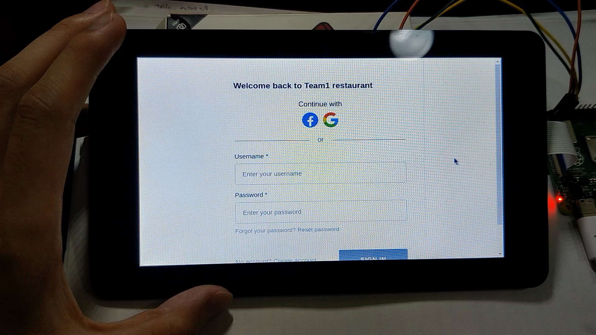
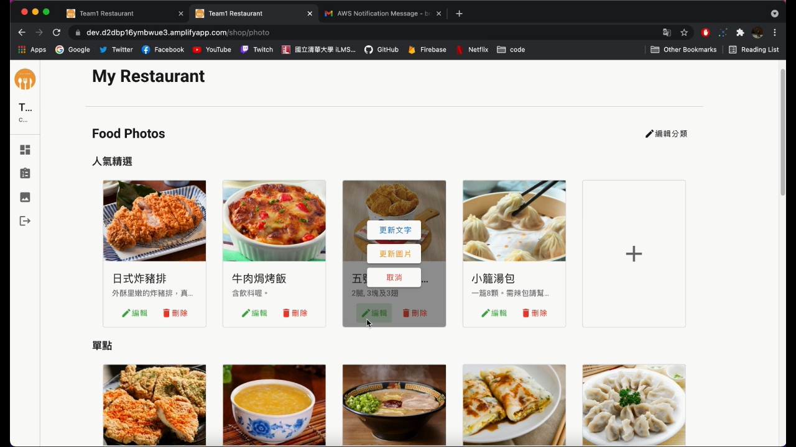
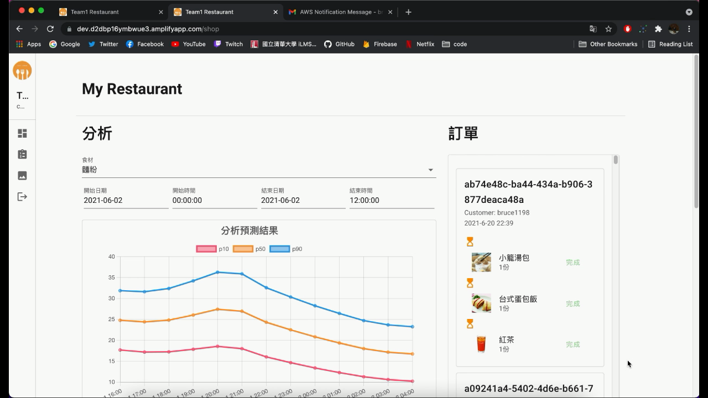

# Ordering System
This is an online ordering system, leveraging the power of AWS.
For clients, the system provides functionalities for ordering food, food recommendations, and communication with restaurants or food providers.
For restaurants or food providers, the system allows them to upload their menus or services, update the progress of food preparation, and forecast the markets.

## Architecture
- Authentication & Authorization: **Amplify** + **Cognito**
- serverless backend: **API Gateway(RESTful API/WebSocket API)** + **Lambda** + **DynamoDB**
- Host static data: **S3**
- Notification: **SNS**
- MQTT communication: **IoT Core**
- DL & Data Analysis: **Rekognition** + **Personalize** + **Forecast** + **Lex**

## Client Demo
The client side is a Raspberry Pi with a touch screen and a camera. Clients can order food and track the preparation progress on the screen.
|  |  |
| :---: | :---: |

https://github.com/elvis027/OrderingSystem/assets/44467974/3a1b1771-59f1-4cbf-a387-795c9fc13456

https://github.com/elvis027/OrderingSystem/assets/44467974/f70dee9e-469f-40d5-8bd0-c9c8fe1bf243

## Restaurant Demo
The restaurant side is a website that can receive orders from clients.
|  |  |
| :---: | :---: |

https://github.com/elvis027/OrderingSystem/assets/44467974/79c586ba-cd65-455b-90e4-3d10312110b5

https://github.com/elvis027/OrderingSystem/assets/44467974/f40cb862-c037-4a17-a959-7b863d0c1b44

https://github.com/elvis027/OrderingSystem/assets/44467974/54b18b04-a821-4bef-89da-cf5dd55e74b2

https://github.com/elvis027/OrderingSystem/assets/44467974/ec9ce23c-0163-4858-9cab-3438bf5fde57
